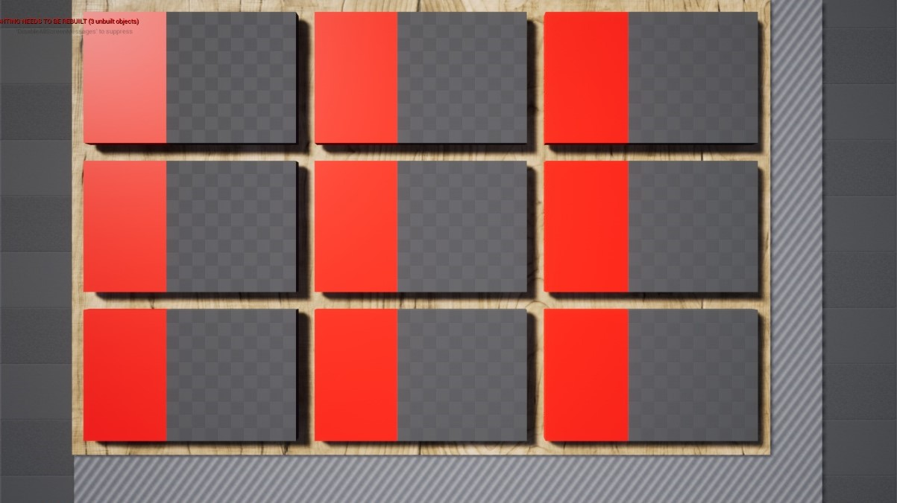

# PlanetAge
Игра по мотивам инвестиционной карточной игры. Сделана в качестве курсового проекта в МГТУ им. Н. Э. Баумана.<br />
Научные руководители: Федорук В. Г., Витюков Ф. А.<br />
Дизайн: Короленко Е. М.<br />
Разработка: Мигранов Р. Р.<br />



## How to setup
1. Clone repository <br />
   using **SSH**: ``` git clone git@github.com:InfantryMan/PlanetAge.git ```; <br />
   using **HTTPS**: ``` git clone https://github.com/InfantryMan/PlanetAge.git```. <br />
   
2. Open file **MyProject.uproject**; <br />

3. In the pop-up window, click "yes" to build the project. <br />
